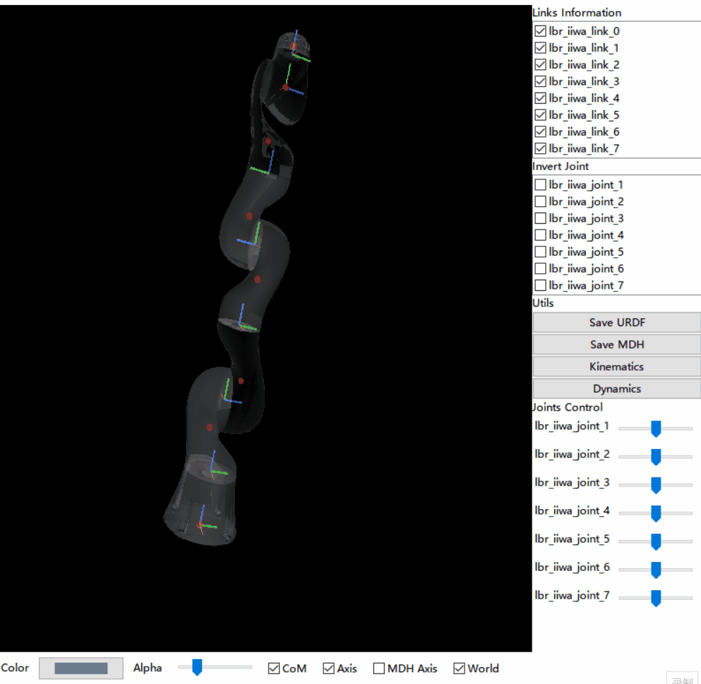

# RoboticsInOne
Robotics In One (RIO) Studio

[Chinese README](./README_CH.md)
## Introduction
RIO is committed to providing a standard and complete tool chain and ecology with a graphical operation interface for the robot community. RIO implements 3D visualization of robot links, joints and center of mass (CoM) by specifying a URDF file, and generates kinematics/dynamics codes via URDF ->MDH ->Kinematics ->Jacobian ->Dynamics.
<p align="center">
    
</p>

## Getting Started
* For windows users, you can 
  * directly download a release version and double click the bat file to run;
  * or clone the source code (usually newer)
    ```bash
    git clone https://github.com/yunlongdong/RoboticsInOne.git
    cd RoboticsInOne
    pip install -r requirements.txt
    python RIO.py
    ```

* For ubuntu users, firstly you should install wxPython following [here](https://wxpython.org/pages/downloads/index.html)
    ```bash
    # note that you should replace ubuntu-22.04 with your own ubuntu version
    pip install -U -f https://extras.wxpython.org/wxPython4/extras/linux/gtk3/ubuntu-22.04 wxPython
    ```

    Then, use the following commands to install other packages
    ```bash
    git clone https://github.com/yunlongdong/RoboticsInOne.git
    cd RoboticsInOne
    # install other packages
    pip install matplotlib sympy plyfile numpy scipy pandas pyrr pybullet anytree
    # install moderngl
    pip install moderngl==5.5.4
    python RIO.py
    ```
## Troubleshooting
* In ubuntu 16.04 if 'error: GLSL 3.30 is not supported' occurs, use the command `export MESA_GL_VERSION_OVERRIDE=3.3` and then run `python RIO.py`.
## Features
1. URDF file visualization, including Link (adjustable transparency), Axis, CoM, etc
2. Joints Control
3. Invert Joint Z-Axis: z axis of any joint can be manually adjusted to achieve joint configuration consistent with the real robot
4. Exporting modified D-H parameters
5. Kinematics: forward kinematics, Jacobian symbolic representation, and code generation
6. Dynamics: mass matrix M, symbolic representation of Inverse Dynamics and code generation
7. System identification: derive the minimum parameter set, generate C++ and Python codes for system identification
8. Verification of the code generation with one single click: randomly generate test samples so that users can verify the correctness by comparing the results of the generated codes with the numerical solution provided by pybullet.
## TODO
* Interface: symoro is currently used for rigid body dynamics derivation; The code verification process currently utilizes pybullet. In the future, we hope to provide more interfaces and leave enough room for extensions. We believe it would be owesome if users are allowed to write their own plugins to connect to any rigid body dynamics library.
* A series of tutorials (including websites, videos, blogs) should be produced.

## Remark
1. URDF Joints Axis should be [0, 0, 1]
2. The urdf file contains only revolute joints
3. Currently, only URDF code generation with 1 subtree is supported
4. Floating base robots are not supported now.

## Contact us
RoboticsInOne QQ Chat Group：179412348
